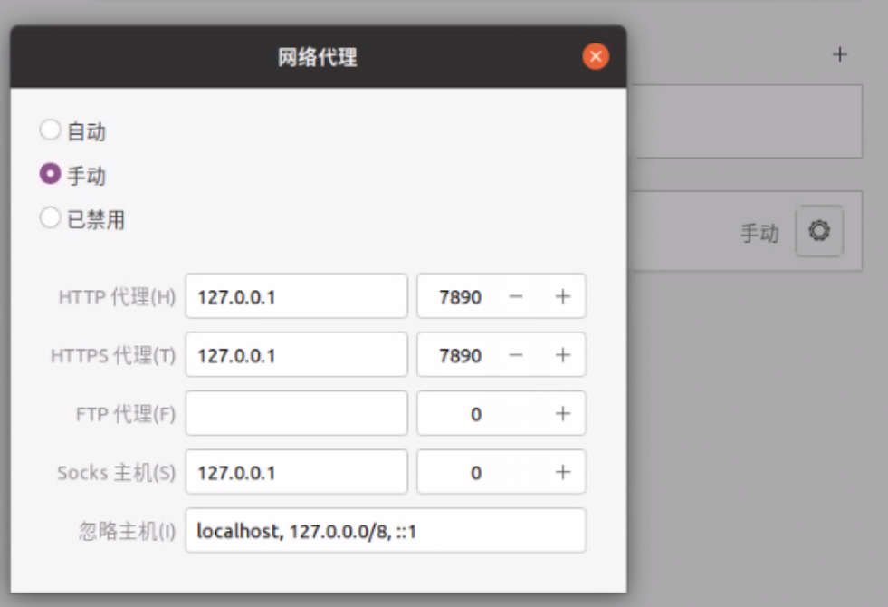

# Mihomo + MetaCubeXD 面板使用说明

本目录用于在 Linux 机器、软路由或远程主机上复用 Mihomo 配置，配合 MetaCubeXD 面板管理节点选择、自动测速和兜底策略，让 OpenAI、ChatGPT 等国外 AI 工具稳定走适合的海外节点。

## 1. 目录约定

这个 `vpn_backups` 项目可以下载到 Linux 机器上的任意目录。下面示例用 `PROJECT_DIR` 表示实际下载后的目录，请按你的实际路径进入：

```bash
cd /path/to/vpn_backups/linux_mihomo
```

本项目里的 `mihomo/` 目录用于保存要备份的 Mihomo 配置：

- `./mihomo/config.yaml`
- `./mihomo/providers/`
- `./mihomo/ui-metacubexd/`，执行 `install-ui.sh` 后生成

Mihomo 实际运行时读取的用户配置目录是：

```bash
$HOME/.config/mihomo
```

首次使用或修改了项目里的配置后，把项目里的 `mihomo/` 同步到实际运行目录：

```bash
mkdir -p "$HOME/.config/mihomo"
cp -a ./mihomo/. "$HOME/.config/mihomo/"
```

同步后，实际生效的配置文件应位于：

```bash
$HOME/.config/mihomo/config.yaml
```

## 2. 下载与安装 Mihomo

当前实际验证过的安装方式，是使用本目录中的 Debian 安装包：

- `mihomo-linux-amd64-v1-alpha-df1c5e5.deb`

该安装包适用于 amd64 / x86_64 Linux。建议优先使用这个包安装，避免直接使用未测试脚本。

```bash
cd /path/to/vpn_backups/linux_mihomo

# 安装已验证过的 deb 包
sudo apt install ./mihomo-linux-amd64-v1-alpha-df1c5e5.deb

# 如果 apt 无法直接安装本地包，可改用 dpkg
sudo dpkg -i ./mihomo-linux-amd64-v1-alpha-df1c5e5.deb
sudo apt-get install -f
```

`untested_install-mihomo.sh` 是未实际使用过的备用脚本。它会从 Mihomo 官方 GitHub Releases 下载版本并安装到 `/usr/bin/mihomo`，目前仅作为参考，不建议作为默认安装方式。

如需自行测试该脚本：

```bash
cd /path/to/vpn_backups/linux_mihomo
chmod +x ./untested_install-mihomo.sh

# 默认安装 GitHub Releases 最新版本
./untested_install-mihomo.sh

# 安装指定版本，例如：
./untested_install-mihomo.sh --version v1.19.27
```

## 3. 自启动服务

`mihomo-linux-amd64-v1-alpha-df1c5e5.deb` 包含系统级 systemd 服务文件：

```text
/usr/lib/systemd/system/mihomo.service
/usr/lib/systemd/system/mihomo@.service
```

默认启动命令是：

```ini
ExecStart=/usr/bin/mihomo -d /etc/mihomo
```

安装包提供服务文件不代表已经开启自启动。系统级服务的常用命令如下：

```bash
# 查看状态
systemctl status mihomo.service

# 开启自启动并立即启动
sudo systemctl enable --now mihomo.service

# 关闭自启动并停止
sudo systemctl disable --now mihomo.service
```

不要直接修改 `/usr/lib/systemd/system/mihomo.service`，升级 mihomo 包时该文件可能被覆盖。需要修改系统级自启动服务时，使用 override：

```bash
sudo systemctl edit mihomo.service
```

如果要让系统级服务读取某个普通用户的 Mihomo 配置，建议明确指定运行用户，并使用 `%h` 引用该用户的 home 目录。把 `<linux-user>` 替换成实际 Linux 用户名：

```ini
[Service]
User=<linux-user>
ExecStart=
ExecStart=/bin/sh -c 'exec /usr/bin/mihomo -d %h/.config/mihomo -secret "$$(cat %h/.config/mihomo/secret)"'
```

保存后重新加载并重启：

```bash
sudo systemctl daemon-reload
sudo systemctl restart mihomo.service
systemctl status mihomo.service
```

如果使用的是当前这套 user service，不需要修改系统级服务；对应文件是 `$HOME/.config/systemd/user/mihomo.service`，管理命令使用 `systemctl --user ...`。

## 4. 管理面板密钥

管理面板登录密钥不写在 `config.yaml` 中，单独保存在：

```bash
$HOME/.config/mihomo/secret
```

该文件只放一行密钥文本，不需要 YAML 格式，例如：

```text
your-secret
```

修改密钥后设置文件权限并重启服务：

```bash
chmod 600 "$HOME/.config/mihomo/secret"
systemctl --user daemon-reload
systemctl --user restart mihomo.service
```

当前 user service 会在启动时读取该文件，并通过 `mihomo -secret` 覆盖 `config.yaml` 中的空 `secret`。注意：这种方式可以避免密钥明文留在 `config.yaml`，但 `-secret` 启动参数仍可能被同机用户从进程参数中看到。

如果是第一次配置 user service，`$HOME/.config/systemd/user/mihomo.service` 中的启动命令应包含：

```ini
ExecStart=/bin/sh -c 'exec /usr/bin/mihomo -d %h/.config/mihomo -secret "$$(cat %h/.config/mihomo/secret)"'
```

## 5. 基本管理

```bash
# 查看状态
systemctl --user status mihomo.service

# 修改配置文件以后先reload再重启
systemctl --user daemon-reload

# 重启
systemctl --user restart mihomo.service

# 停止
systemctl --user stop mihomo.service

# 开启自启
systemctl --user enable mihomo.service

# 关闭自启
systemctl --user disable mihomo.service
```

## 6. TUN 权限说明

当前方案是给 `mihomo` 二进制授予 TUN 所需能力，以便用户级服务正常使用 TUN。

```bash
# 授予能力
sudo setcap cap_net_admin,cap_net_bind_service+ep /usr/bin/mihomo

# 重启服务
systemctl --user restart mihomo.service
```

验证：

```bash
getcap /usr/bin/mihomo
# 期望输出:
# /usr/bin/mihomo = cap_net_bind_service,cap_net_admin+ep

systemctl --user status mihomo.service
journalctl --user -u mihomo.service -f
```

如果需要撤销能力（恢复默认安全策略）：

```bash
sudo setcap -r /usr/bin/mihomo

# 验证能力已撤销；正常情况下不应再输出 cap_net_admin / cap_net_bind_service
getcap /usr/bin/mihomo
```

撤销后需要确认配置文件里没有开启 TUN：

```yaml
tun:
  enable: false
```

如果实际使用的 `~/.config/mihomo/config.yaml` 仍然是 `tun.enable: true`，撤销能力后重启服务可能会失败。确认 TUN 已关闭后，再重启服务：

```bash
systemctl --user restart mihomo.service
systemctl --user status mihomo.service
```

## 7. MetaCubeXD 面板安装

`install-ui.sh` 用于从 `https://github.com/metacubex/metacubexd` 的 `gh-pages` 分支下载静态面板。

脚本默认安装到本项目的 `./mihomo/ui-metacubexd/`，不需要把脚本复制到 `~/.config/mihomo` 再运行。

如果 `./mihomo/ui-metacubexd/` 已存在，脚本默认会先备份成类似 `ui-metacubexd.bak.20260627-xxxxxx` 的目录，再安装新版。

```bash
cd /path/to/vpn_backups/linux_mihomo

# 默认安装，已存在旧面板时会先备份
chmod +x ./install-ui.sh
./install-ui.sh

# 不保留旧面板备份，直接替换
./install-ui.sh --no-backup
```

下载完成后，把项目里的 `mihomo/` 同步到 Mihomo 实际运行目录：

```bash
cp -a ./mihomo/. "$HOME/.config/mihomo/"
systemctl --user restart mihomo.service
```

如果你想直接把 UI 下载到实际运行目录，也可以这样运行：

```bash
MIHOMO_DIR="$HOME/.config/mihomo" ./install-ui.sh
```

### 7.1 MetaCubeXD 默认后端地址

MetaCubeXD 静态面板的默认后端地址配置在：

```text
./mihomo/ui-metacubexd/config.js
```

其中：

```js
defaultBackendURL: window.location.origin
```

这个配置会在浏览器打开面板时自动使用当前访问地址作为 Mihomo 后端。例如你访问 `http://<mihomo所在机器的IP>:9090/ui/`，`window.location.origin` 会自动得到 `http://<mihomo所在机器的IP>:9090`。

当前配置里：

```yaml
external-controller: 0.0.0.0:9090
external-ui: ui-metacubexd
```

表示 Mihomo 在本机所有网卡监听 `9090` 端口，并使用 `ui-metacubexd` 作为外部 UI 目录。因此在其他设备浏览器访问时，通常使用：

```text
http://<mihomo所在机器的IP>:9090/ui/
```

## 8. 配置策略与节点优先级

本项目的 `./mihomo/config.yaml` 是一个模板配置，设计目标是稳定地按用途选择节点、在多个订阅中选择节点、避免手动切换。订阅 URL 属于隐私信息，项目里的配置只保留占位符，实际订阅链接应只写在 Mihomo 实际运行目录：

```bash
$HOME/.config/mihomo/config.yaml
```

### 8.1 监听地址与隐私占位符

模板里还包含局域网访问控制占位符。把项目配置同步到实际运行目录后，在 `$HOME/.config/mihomo/config.yaml` 中替换这些值，不要把真实内网 IP 或订阅 token 提交回仓库：

```yaml
bind-address: "<MIHOMO_LAN_IP>"
lan-allowed-ips:
  - 127.0.0.1/32
  - "<MIHOMO_LAN_IP>/32"
  - "<LAN_CLIENT_IP>/32"

proxy-providers:
  良心云:
    url: "<LIANGXINYUN_SUBSCRIPTION_URL>"
  魔戒:
    url: "<MOJIE_SUBSCRIPTION_URL>"
```

- `<MIHOMO_LAN_IP>`：运行 Mihomo 的 Linux 机器内网 IP。
- `<LAN_CLIENT_IP>`：允许访问本机代理端口的局域网客户端 IP；有多台客户端时逐行追加。
- `<LIANGXINYUN_SUBSCRIPTION_URL>` / `<MOJIE_SUBSCRIPTION_URL>`：实际订阅链接。

如果只在运行 Mihomo 的同一台 Linux 机器上使用代理，可以把应用代理地址写成 `127.0.0.1:7890`。如果局域网内其他机器要使用这台机器的代理，则应用代理地址应写成 `http://<MIHOMO_LAN_IP>:7890`，并把对应客户端 IP 加到 `lan-allowed-ips`。

不建议在脚本或文档里写死 `/home/<某个用户名>` 这样的路径。普通 shell 脚本使用 `$HOME` 或 `${HOME}`，systemd user service 使用 `%h`，这样换用户名后仍然可用。

### 8.2 Linux 桌面与远程插件代理

如果 Cursor 远程 extensionHost 或 Codex 相关插件没有继承宿主代理，可能会直连并反复 reconnect。优先在 shell 环境里显式设置代理变量；必要时再在 Linux 图形界面里设置系统网络代理。

Codex 插件使用的代理环境变量配置参考 [`linux_mihomo/.codex/.env`](./.codex/.env)。如果是其他 shell、服务或插件环境，请按该文件里的变量写法调整到对应配置位置。

Linux 图形界面的手动代理设置可以参考下图：



其中 HTTP 代理和 HTTPS 代理使用 `127.0.0.1`、端口 `7890`。如果需要填写 Socks 主机，`mixed-port: 7890` 也可以使用 `127.0.0.1`、端口 `7890`；如果不使用 Socks，可以留空。

节点的日常切换是在 MetaCubeXD 图形界面里完成的，不需要手动改 YAML 里的 `proxy-groups`。确认 Mihomo 服务和 UI 都已启动后，在浏览器打开：

```text
http://<mihomo所在机器的IP>:9090/ui/
```

进入 MetaCubeXD 的 `代理` / `Proxies` 页面，找到策略组 `节点选择`，把它切换为 `良心云兜底`。这是日常常用配置。

配置里有：

```yaml
profile:
  store-selected: true
```

所以在 MetaCubeXD 里选过的策略会被记住，服务重启后通常仍沿用上次选择。

### 8.3 顶层选择

`节点选择` 是 MetaCubeXD 里需要操作的主要策略组。规则里的 OpenAI / ChatGPT 相关域名，以及最后的 `MATCH` 兜底流量，都会走 `节点选择`：

```yaml
- DOMAIN-SUFFIX,openai.com,节点选择
- DOMAIN-SUFFIX,chatgpt.com,节点选择
- DOMAIN-SUFFIX,oaistatic.com,节点选择
- DOMAIN-SUFFIX,oaiusercontent.com,节点选择
- MATCH,节点选择
```

在 MetaCubeXD 的 `节点选择` 策略组里，常用优先看这几个选项：

- `良心云兜底`：日常常用。优先使用良心云的新加坡、日本、美国自动组，最后再兜到 `AI自动选择`。
- `AI自动选择`：只在适合 AI 服务的节点池里自动测速选择。
- `自动选择`：在两个订阅的通用自动选择组之间测速选择。
- `故障转移`：按订阅顺序做可用性兜底。
- `魔戒兜底`：优先使用魔戒的新加坡、日本、美国自动组，最后再兜到 `AI自动选择`。
- `DIRECT`：手动直连。

### 8.4 兜底组优先级

`良心云兜底` 和 `魔戒兜底` 都是 `fallback` 组，会按列表顺序做可用性兜底。前面的候选组整体不可用时，才会继续尝试后面的组；当前面的组恢复可用后，下一轮健康检查会自动切回更靠前的组。

日常选择 `良心云兜底` 时，顺序是：

1. `良心云新加坡自动`
2. `良心云日本自动`
3. `良心云美国自动`
4. `AI自动选择`

选择 `魔戒兜底` 时，顺序是：

1. `魔戒新加坡自动`
2. `魔戒日本自动`
3. `魔戒美国自动`
4. `AI自动选择`

当前配置的健康检查间隔是 `300` 秒。已经建立的连接通常不会被强制迁移，新连接会使用恢复后的选择结果。

其中 `新加坡自动`、`日本自动`、`美国自动` 这些区域组本身是 `url-test`，会在对应地区节点里按延迟自动选择。

### 8.5 AI 自动选择

`AI自动选择` 是 `url-test` 组，会在下面两个组之间按延迟自动选择：

```yaml
AI自动选择:
  - AI良心云自动
  - AI魔戒自动
```

`AI良心云自动` 和 `AI魔戒自动` 都排除了中国节点（香港、台湾）、流量信息和套餐到期提示类节点：

```yaml
exclude-filter: "香港|台湾|台灣|🇭🇰|🇹🇼|HK|HKT|TW|WAP|^(剩余流量|套餐到期)"
```

这样做的目的，是让 AI 相关访问默认避开更容易不稳定或不适合的节点名称，只在更适合的节点池里自动测速。

注意：`url-test` 不是固定按列表顺序使用节点，而是按探测结果选择当前更合适的候选。列表顺序主要决定候选范围和面板展示顺序。

## 9. 订阅更新说明

配置文件：`~/.config/mihomo/config.yaml`  
订阅提供者键名：`良心云`、`魔戒`

### 9.1 情况 1：订阅链接不变（只是节点内容更新）

当前已配置自动更新（`interval: 21600`，即每 6 小时自动拉取）。  
如果要立即更新，执行：

```bash
systemctl --user restart mihomo.service
```

### 9.2 情况 2：订阅链接变更（更换新 URL）

1. 修改 Mihomo 实际运行目录里的配置文件：

```bash
nano "$HOME/.config/mihomo/config.yaml"
```

需要更新以下字段：

- `proxy-providers.良心云.url`
- `proxy-providers.魔戒.url`

1. 校验配置：

```bash
mihomo -t -d "$HOME/.config/mihomo" -f "$HOME/.config/mihomo/config.yaml"
```

1. 重启服务：

```bash
# 修改配置文件以后先reload再重启
systemctl --user daemon-reload

systemctl --user restart mihomo.service
```

### 9.3 情况 3：增加一个订阅

下面以新增一个名为 `新订阅` 的订阅为例。订阅名可以自己改，但要保持前后一致。

1. 在 `proxy-providers` 里新增订阅提供者：

```yaml
proxy-providers:
  良心云:
    # 原有配置省略

  魔戒:
    # 原有配置省略

  新订阅:
    type: http
    url: "填新订阅的订阅链接"
    path: ./providers/new-subscription.yaml
    interval: 21600
    health-check:
      enable: true
      url: https://www.gstatic.com/generate_204
      interval: 300
```

如果这个订阅源需要特殊请求头，例如指定 `User-Agent`，可以参考 `魔戒` 的写法添加 `header`。

1. 在 `proxy-groups` 里为新订阅增加基础策略组：

```yaml
  - name: 新订阅节点
    type: select
    exclude-filter: "^(剩余流量|套餐到期)"
    use:
      - 新订阅

  - name: 新订阅自动选择
    type: url-test
    url: https://www.gstatic.com/generate_204
    interval: 300
    tolerance: 50
    exclude-filter: "^(剩余流量|套餐到期)"
    use:
      - 新订阅

  - name: 新订阅故障转移
    type: fallback
    url: https://www.gstatic.com/generate_204
    interval: 300
    exclude-filter: "^(剩余流量|套餐到期)"
    use:
      - 新订阅

  - name: AI新订阅自动
    type: url-test
    url: https://www.gstatic.com/generate_204
    interval: 300
    tolerance: 50
    exclude-filter: "香港|台湾|台灣|🇭🇰|🇹🇼|HK|HKT|TW|WAP|^(剩余流量|套餐到期)"
    use:
      - 新订阅
```

如果需要按地区筛选，也可以继续增加类似 `新订阅新加坡自动`、`新订阅日本自动`、`新订阅美国自动` 的组，写法参考现有的 `良心云新加坡自动`、`魔戒日本自动` 等组。

1. 把新订阅接入上层策略组：

```yaml
  - name: 节点选择
    type: select
    proxies:
      - 全部节点
      - 自动选择
      - 故障转移
      - AI自动选择
      - 良心云兜底
      - 魔戒兜底
      - 新订阅节点
      - 新订阅自动选择
      - 新订阅故障转移
      - AI新订阅自动
      - DIRECT

  - name: 全部节点
    type: select
    proxies:
      - 良心云节点
      - 魔戒节点
      - 新订阅节点
      - DIRECT

  - name: 自动选择
    type: url-test
    url: https://www.gstatic.com/generate_204
    interval: 300
    tolerance: 50
    proxies:
      - 良心云自动选择
      - 魔戒自动选择
      - 新订阅自动选择

  - name: 故障转移
    type: fallback
    url: https://www.gstatic.com/generate_204
    interval: 300
    proxies:
      - 良心云故障转移
      - 魔戒故障转移
      - 新订阅故障转移

  - name: AI自动选择
    type: url-test
    url: https://www.gstatic.com/generate_204
    interval: 300
    tolerance: 50
    proxies:
      - AI良心云自动
      - AI魔戒自动
      - AI新订阅自动
```

注意：上面是示例片段，不是让你重复创建已有的 `节点选择`、`全部节点`、`自动选择`、`故障转移`、`AI自动选择`。实际修改时，应在现有同名策略组的 `proxies` 列表里追加对应条目。

### 9.4 情况 4：减少一个订阅

下面以删除 `魔戒` 订阅为例。

1. 从 `proxy-providers` 删除整个 `魔戒` 配置块：

```yaml
proxy-providers:
  良心云:
    # 保留

  # 删除 魔戒: 以及它下面的 type、url、path、header、interval、health-check 等配置
```

1. 删除所有只使用 `魔戒` 的策略组，例如：

```yaml
  - name: 魔戒节点
  - name: 魔戒自动选择
  - name: 魔戒故障转移
  - name: 魔戒新加坡自动
  - name: 魔戒日本自动
  - name: 魔戒美国自动
  - name: AI魔戒自动
  - name: AI魔戒
  - name: 魔戒新加坡
  - name: 魔戒日本
  - name: 魔戒美国
  - name: 魔戒兜底
```

删除时要删掉每个 `- name: ...` 对应的完整 YAML 块，不能只删名字。

1. 从上层策略组里删除对 `魔戒` 相关组的引用：

```yaml
  - name: 节点选择
    proxies:
      # 删除这些引用
      # - 魔戒兜底
      # - 魔戒节点
      # - 魔戒自动选择
      # - 魔戒故障转移
      # - 魔戒新加坡自动
      # - 魔戒日本自动
      # - 魔戒美国自动
      # - AI魔戒
      # - AI魔戒自动
      # - 魔戒新加坡
      # - 魔戒日本
      # - 魔戒美国

  - name: 全部节点
    proxies:
      # 删除:
      # - 魔戒节点

  - name: 自动选择
    proxies:
      # 删除:
      # - 魔戒自动选择

  - name: 故障转移
    proxies:
      # 删除:
      # - 魔戒故障转移

  - name: AI自动选择
    proxies:
      # 删除:
      # - AI魔戒自动
```

减少订阅后，最容易出错的是 `proxies` 里还残留已删除的策略组名称，或者 `use` 里还引用已删除的订阅提供者。修改后一定要校验配置。

### 9.5 修改后校验并重启

不管是增加、删除还是改订阅链接，修改后都建议先校验：

```bash
mihomo -t -d "$HOME/.config/mihomo" -f "$HOME/.config/mihomo/config.yaml"
```

校验通过后再重启：

```bash
systemctl --user daemon-reload
systemctl --user restart mihomo.service
```
